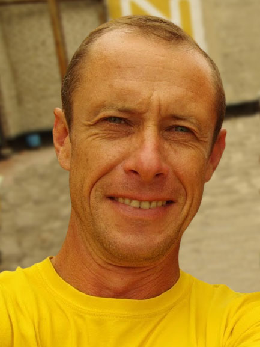

---
# Borys Maksymov

## Contact Info
**Location:** Zaporozhye, Ukraine

**Phone:** +38-063-808-83-84

**E-mail:** radiatorzp@gmail.com

**Telegram:** @FullForward

**Discord rs-school:** Borys#4139

**GitHub:** [BorysMax](https://github.com/BorysMax)

## About me
I am an engineer and project manager in the mechanical engineering and service industries. All my life I have been interested in programming. I have experience in digital marketing and tourism business organization. I want to become a professional in new IT technologies.

## Skills
* Google Analytics
* Google Ads
* Google Tag Manager
* Google Console
* Social Media Management Tools

## Code example
```
function createPhoneNumber(array) {
    let string = "("
    for (let i = 0; i < 10; i++) {
        string += array[i];
            if (i === 2) {
                string += ") ";
            } else if (i === 5) {
                string += "-";
            }
    }
return string;
}
```

## Work Experience
I have no front-end experience, but I administer several of my sites and have been actively involved in their development

## Education
Zaporozhye Technical University - aircraft engines and power plants

## Languages
_Ukrainian and Russian_ - native

_English_ - A2